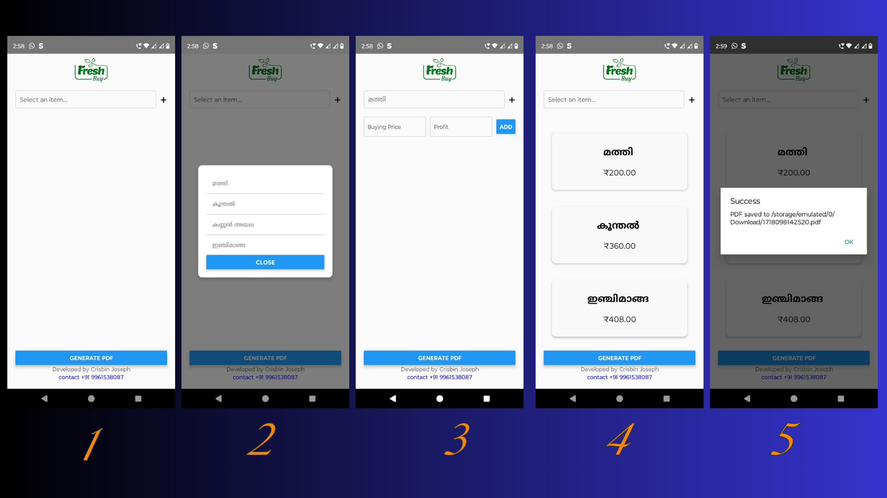
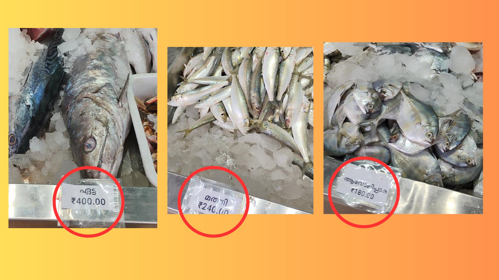

# Price Tag Generator

A React Native application to create and print price tags for items in a shop using a bill printing machine. Users can select items from a dropdown list, add new items, input prices, and generate a PDF containing the price tags. The PDF can then be printed using a bill printing machine.

## Features

- Dropdown List Management: Load, save, and manage items in the dropdown list.
- Add New Items: Add new items to the dropdown list.
- Input Prices: Enter buying price and profit to calculate the selling price.
- Generate PDF: Create a PDF containing the price tags for the selected items.
- Persistent Storage: Save items in the dropdown list using `AsyncStorage`.
- Print Price Tags: Use the generated PDF to print price tags using a bill printing machine.

## Screenshots



## Real Life Sample


## Installation

### Prerequisites

- Node.js
- React Native CLI
- Android Studio / Xcode for emulators

### Steps

1. **Clone the repository**:
    ```sh
    git clone https://github.com/crisbinj/Nova-Price-tag.git
    cd price-tag-generator
    ```

2. **Install dependencies**:
    ```sh
    npm install
    ```

3. **Link native dependencies**:
    ```sh
    npx react-native link
    ```

4. **Run the application**:
    - For Android:
      ```sh
      npx react-native run-android
      ```
    - For iOS:
      ```sh
      npx react-native run-ios
      ```

## Usage

1. **Select an Item**: Tap on the dropdown to select an item from the list. If the item does not exist, add it using the add item button.

2. **Add New Items**: Tap on the `+` button to add a new item to the dropdown list. Enter the item name and save.

3. **Enter Prices**: After selecting an item, input the buying price and profit to calculate the selling price. Tap the `Add` button to add the item to the list of selected items.

4. **Generate PDF**: Once all items are added, tap the `Generate PDF` button to create a PDF containing the price tags. The PDF will be saved in the Downloads directory.

5. **Print PDF**: Use the generated PDF to print the price tags using a bill printing machine.

## Code Overview

### Components

- **App**: The main component that handles state management, item selection, input handling, and PDF generation.
- **Modal**: For displaying the dropdown list of items.
- **FlatList**: For displaying the list of selected items.

### Libraries Used

- **React Native**: Core framework for building the application.
- **AsyncStorage**: For persistent storage of items.
- **RNHTMLtoPDF**: For generating PDF files from HTML content.
- **RNFS**: For file system operations.


## License

This project is licensed under the MIT License - see the [LICENSE](LICENSE) file for details.

## Contact

Developed by Crisbin Joseph

- Phone: +91 9961538087
